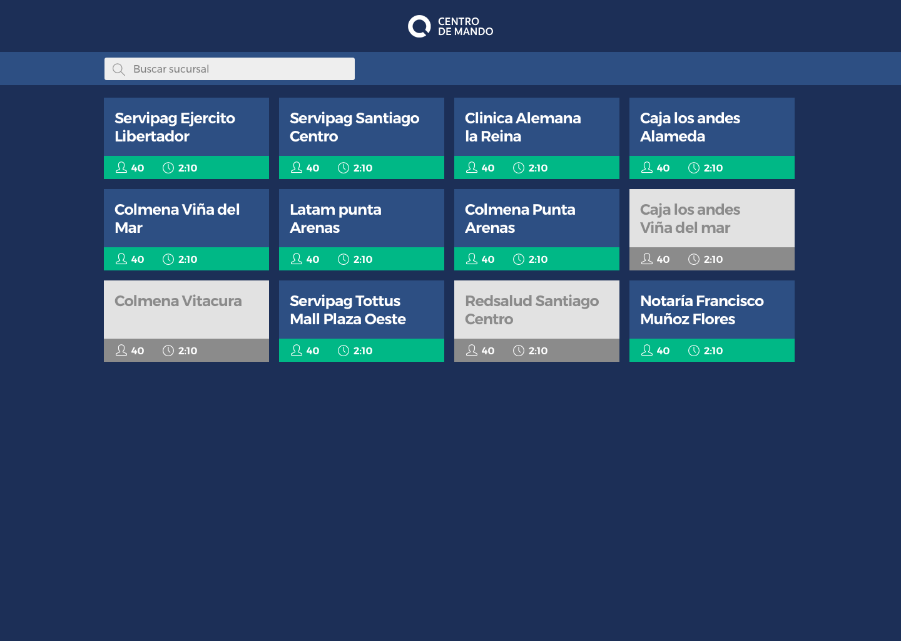

# Desafio Frontend Zeroq

Zeroq esta en busca de un desarrollador frontend para unirse a su equipo de desarrollo, este desafío tiene la finalidad de poner a prueba los conocimientos deseables para este puesto.

El desafío consiste en consumir una API Restful, luego listar  las oficinas proporcionadas con algunos atributos.

Se proporcionará, un mockup de como debe quedar el prototipo. Este es una version muy simple y reducida de nuestro dashboard en tiempo real (https://zeroq.cl/command/) , y lo que queremos es validar que el concursante pueda maquetar un diseño dado fielmente.

## Restricciones

1. Se debe realizar usando el framework react.js ( Esto es excluyente ya que es el framework que usamos en todos nuestros front )

2. Se puede usar cualquier libreria

## Lo que necesitaras

#### Endpoint

El unico endpoint a consultar será:

 GET: https://dev.zeroq.cl/desafio-frontend/

#### Assets

En la carpeta assets de este proyecto estaran las imagenes de guía y logotipo.

Prototipo a realizar:

Leyenda de ayuda para conocer donde deben mostrarse los datos:

## Lo que debes realizar

#### 1. Listar las oficinas proporcionadas en el endpoint.

Cada oficina tiene un atributo `lines` y a su vez cada una de ellas tienen atributos `waiting` que son personas en fila y `elapsed` que es el tiempo promedio de atención de esa fila en segundos.

- Para obtener el total de personas en fila hay que sumar los `waiting` de las filas de una oficina.
- Para obtener a atención promedio hay que promediar los `elapsed` de las filas de las oficinas y mostrarlas en formato `HH:mm:ss`.

#### 2. Agregar un campo de texto para filtrar oficinas por su nombre.
El nombre se obtiene en el tributo `name` de cada oficina

#### 3. Maquetar segun diseño entregado

Se evalua que el prototipo se parezca lo mas posible a los screens proporcionados.

#### 4. Enviar repositorio con el prototipo

Se debe enviar el repositorio con un readme donde se explique como construir, correr y testear la aplicación.

## Bonus (Deseable)

- Buenas practicas de programación en javascript
- Uso de TDD
- Fidelidad al diseño proporcionado
- Diseño Responsivo

